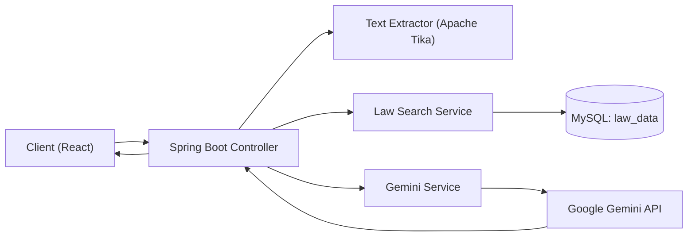

# Signsafe Backend

계약서 독소조항 분석을 위한 Spring Boot 백엔드입니다. 계약서 텍스트를 추출하고, `law_data`에서 관련 법령을 검색한 뒤 Gemini로 분석 및 수정 제안을 생성합니다.

# SignSafe Backend 🛡️
AI 기반 계약서 독소조항 탐지 및 법률 자문 서비스

## 1. 프로젝트 소개
사회초년생들이 어려운 계약서 용어와 독소조항으로 피해를 입지 않도록 돕는 서비스입니다. 사용자가 업로드한 계약서를 텍스트로 추출하고, 관련 법령 데이터를 매칭하여 Gemini가 안전성을 검토합니다.

## 2. 시스템 아키텍처
아래 흐름도는 데이터 흐름을 간단히 정리한 것입니다. (이미지 캡처로 대체 가능)



## 3. 핵심 기술 및 문제 해결
- RAG(검색 증강 생성) 기반 법률 분석
  - Before: Gemini 단독 질의로 환각(Hallucination) 발생 가능
  - After: `LawDataSearchService`가 키워드로 법령을 선검색하고, 컨텍스트 주입으로 정확도 향상
- 다양한 문서 포맷 지원
  - Apache Tika를 활용해 PDF/오피스 문서 등 비정형 계약서 텍스트 추출 파이프라인 구축
- 외부 API 연동 안정화
  - WebClient 기반 호출 설정과 타임아웃/버퍼 제한으로 안정적인 수집 흐름 구성

## 4. Tech Stack
- Language: Java 17
- Framework: Spring Boot 3.5.9, Gradle
- Database: MySQL 8, JPA (Hibernate)
- AI/External: Google Gemini API, Apache Tika

## 5. ERD 설계
- `law_data`와 `contract_analysis`(분석 로그) 중심의 관계를 표현한 ERD 이미지를 추가하세요.
- (이미지 삽입 예정)

## 6. API 명세 (Swagger/OpenAPI)
- SpringDoc 기반으로 자동 생성된 Swagger UI를 활용합니다.
- (스크린샷 또는 링크 삽입 예정)

## 7. 실행 방법 (Getting Started)

## 기술 스택
- Java 17, Spring Boot 3.5.9, Gradle
- Spring Web, Spring Data JPA, WebClient
- MySQL (runtime), H2 (tests)
- Google GenAI SDK
- Apache Tika/PDFBox/POI (파일 텍스트 추출)

## 실행 환경
- JDK 17+
- MySQL 8+

## 설정
기본 설정은 `src/main/resources/application.properties`에 있습니다. 민감 정보는 환경 변수로 주입됩니다 (spring-dotenv 사용).

환경 변수:
- `GEMINI_API_KEY`
- `DB_PASSWORD`

MySQL 설정:
- `spring.datasource.url`
- `spring.datasource.username`
- `spring.datasource.password`

## 실행
```powershell
./gradlew bootRun
```

## 테스트
```powershell
./gradlew test
```

## API
Base URL: `http://localhost:8080`

### POST `/api/analysis/text`
계약서 원문 텍스트를 분석합니다.

요청 바디:
```json
{
  "text": "...contract text...",
  "uuid": "guest-uuid",
  "title": "optional title"
}
```

응답(요약):
```json
{
  "analysisId": 1,
  "title": "...",
  "userPrompt": "...",
  "analysis": "...",
  "summary": "...",
  "coreResult": "...",
  "suggestion": "...",
  "createdAt": "2026-02-11T12:00:00",
  "lawDataUsed": true,
  "lawKeywords": ["..."],
  "lawSnippets": ["..."]
}
```

### POST `/api/analysis/file`
업로드한 계약서 파일을 분석합니다.

폼 데이터:
- `file`: 계약서 파일
- `uuid`: 게스트 UUID

### POST `/api/gemini/ask`
Gemini 단일 프롬프트 호출용 API입니다.

요청 바디:
```json
{
  "prompt": "...",
  "uuid": "guest-uuid"
}
```

## 비고
- 법령 근거는 `law_data` 테이블을 키워드로 검색해 수집합니다 (`LawDataSearchService`).
- `lawDataUsed`, `lawKeywords`, `lawSnippets` 필드로 법령 근거 사용 여부와 근거 텍스트를 확인할 수 있습니다.
- CORS 허용 도메인은 `src/main/resources/application.properties`에서 설정합니다.
